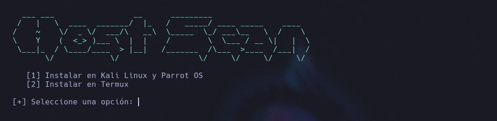
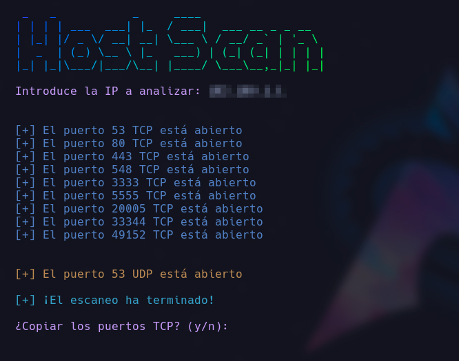
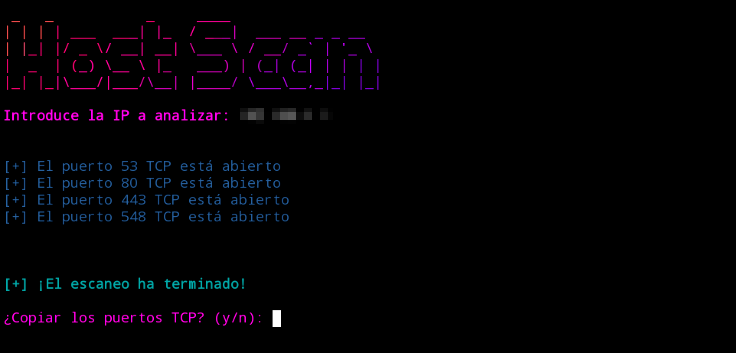

# Host Scan

<p align="center">

</p>

Este script se basa en una implementación eficiente y versátil, que permite a los usuarios detectar qué puertos están abiertos evadiendo el firewall de un sistema remoto. Con este script, los usuarios pueden realizar rápidamente un escaneo exhaustivo de los puertos de una IP.

<br>

## Kali Linux y Parrot OS
```
git clone https://github.com/bl4ck44/host-scan.git

cd host-scan

sudo chmod +x setup.sh

sudo bash setup.sh

python scan.py
```

## Termux

```
git clone https://github.com/bl4ck44/host-scan.git

cd host-scan

chmod +x setup.sh

bash setup.sh

python scan.py
```

<br>

<p align="center">

</p>

<br>

<p align="center">

</p>

<br>

<p align="center">

</p>

### ⚠️ **Aviso**

Este script ha sido desarrollado únicamente con fines **educativos y de investigación en ciberseguridad**.

No me responsabilizo del mal uso que se pueda dar ni de los daños que puedan ocasionarse por su ejecución.

El uso indebido de este material puede ser **ilegal**.